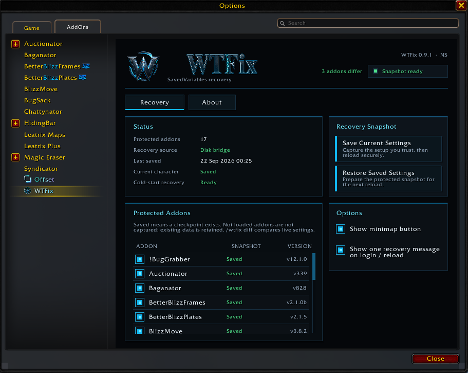

# WTFix

### SavedVariables recovery for **World of Warcraft: Forever**

WTFix lets you save a working copy of your addon settings and restore it later if something gets reset, overwritten or otherwise goes wrong.

WTFix keeps using that saved snapshot until **you** choose to replace it with a new one.

---

## Download

### WTFix 0.9.3

**[Download WTFix 0.9.3](https://github.com/eggntoast/WTFix-Public/releases/tag/v0.9.3)**

### Windows

| Package | Use |
| --- | --- |
| `WTFix-Full-0.9.3.zip` | **Recommended for a fresh Windows installation.** Includes the addon runtime, Windows launcher and preparation components. |
| `WTFix-Launcher-0.9.3.zip` | For users who already install the WTFix addon/runtime separately, including through CurseForge. |

**[Windows installation guide](docs/installation.md)**

### Linux

| Package | Use |
| --- | --- |
| `WTFix-Linux-Full-0.9.3.zip` | Includes the addon runtime, Linux preparation tools and companion. |
| `WTFix-Linux-Prepare-0.9.3.zip` | Linux preparation tools and companion only, for an existing WTFix runtime installation. |

Linux preparation requires **Python 3.10+**.

**[Linux installation and preparation guide](docs/linux-preparation.md)**

Linux preparation uses explicit game-folder and account selection. It does **not** choose a Wine/Proton runner and does **not** launch Battle.net, Wine, Proton or WoW.

After preparation, start WoW normally through your existing launcher or game manager and verify preparation with `/wtfix status` before using Save or Restore.

SHA256 hashes for the official release packages are listed in the **[WTFix 0.9.2 release notes](https://github.com/eggntoast/WTFix-Public/releases/tag/v0.9.3)**.

> Do **not** use GitHub's automatically generated **Source code** ZIP/TAR files as WTFix installation packages. Use the named WTFix downloads attached to the release.

CurseForge distributes the addon/runtime separately. GitHub provides the complete Windows and Linux release packages.

---

## Updating

### From 0.9.2

Update the WTFix addon/runtime to 0.9.3.

Bridge protocol 1 and snapshot schema 1 are unchanged, so existing Windows and Linux preparation remains compatible.

Some existing Forever characters may be asked once to **Link Character** when WTFix finds more than one compatible saved character record. Choose the saved record you recognize and reload once.

Linking does not Save Snapshot, merge records or replace the trusted checkpoint.
### From 0.8.8

Update both the WTFix addon/runtime and current preparation tools.

Windows users upgrading directly from 0.8.8 should run the current launcher once with WoW completely closed so WTFix regenerates preparation using the byte-safe SavedVariables handling introduced in 0.9.0.

Updating only the addon leaves older generated bootstrap data in place.

The byte-safe preparation prevents new encoding corruption in binary or non-UTF-8 SavedVariables data. It cannot reconstruct data that was already corrupted by an older preparation. Preserve known-good backups if recovery may be required.

---

## What WTFix does

WTFix is designed around one simple idea:

**save a known-good addon setup and keep it trusted until you explicitly save another one.**

It supports addons declaring standard:

- account-wide SavedVariables
- per-character SavedVariables
- combinations of both

Coverage depends on what each addon actually stores in its declared SavedVariables.

### Save

**Save Current Settings → Save Snapshot → Reload Now**

WTFix captures the currently committed SavedVariables for the protected addons and makes them your new trusted recovery checkpoint.

### Restore

**Restore Saved Settings → Prepare Restore → Reload Now**

WTFix restores the trusted checkpoint and discards unsaved changes for protected addons.

> [!IMPORTANT]
> WTFix protects the SavedVariables state that actually exists when you save the snapshot.
>
> Some addons do not immediately commit every settings change to SavedVariables. If an addon has its own **Apply** or **Reload** workflow, complete that first and verify the settings survived before creating a new WTFix snapshot.

---

## Preparation is required

Installing the addon runtime alone does **not** prepare recovery.

Until preparation succeeds, WTFix clearly shows:

> **SETUP REQUIRED**

and keeps **Save** and **Restore** disabled.

### Windows

With WoW closed, run:

`WTFix Launcher.cmd`

The Windows launcher:

- prepares the recovery environment
- discovers supported addon SavedVariables
- verifies the disk bridge
- backs up recovery inputs
- opens Battle.net when preparation completes

The launcher does **not** remain running in the background.

After successful Windows preparation:

- keep both **WTFix** and **WTFix_Data** enabled
- normal `/reload` works
- relogs and full client restarts work
- the launcher does **not** need to run before every normal WoW session

### Linux

Extract the Linux package into a normal user-owned tools folder outside `Interface/AddOns`.

Linux preparation:

- requires Python 3.10+
- uses explicit game-folder and account selection
- prepares the WTFix_Data companion and disk bridge
- creates verified recovery-input backups
- does not guess your Wine prefix
- does not choose a Wine/Proton runner
- does not launch Battle.net or WoW
- does not install a background service

If you use **Linux Full**, install or update the bundled `AddOn/WTFix` runtime explicitly before applying preparation.

If the runtime is already managed separately, use **Linux Prepare** instead.

After preparation completes:

1. Start WoW normally through your existing launcher or game manager.
2. Keep both **WTFix** and **WTFix_Data** enabled.
3. Run `/wtfix status`.
4. Verify preparation is ready before using Save or Restore.

See the full **[Linux installation and preparation guide](docs/linux-preparation.md)**.

---

## Installed a new addon and it does not appear in Protected Addons?

> [!IMPORTANT]
> **Close WoW completely and refresh WTFix preparation.**

WTFix discovers supported addon SavedVariables during preparation.

If you install a new addon after WTFix was already prepared — for example **TomTom** or another addon that declares SavedVariables — WTFix may not know about that addon yet.

The normal procedure is:

1. **Close WoW completely.**
2. Refresh preparation:
   - **Windows:** run `WTFix Launcher.cmd`.
   - **Linux:** rerun the Linux preparation tool for the intended installation/account.
3. Let preparation complete successfully.
4. Start WoW normally.
5. Open WTFix and check **Protected Addons**.

The newly discovered addon should then be available for protection if it declares SavedVariables that WTFix supports.

**You do not need to reinstall WTFix. You only need to refresh preparation.**

This is also why preparation should be refreshed after installing or updating addons that change their SavedVariables declarations.

If an addon is still missing after successful preparation, use `/wtfix check` and report it so its SavedVariables behavior can be investigated.

---

## WTFix 0.9.3

What's new:

- Fixed cold-login character recognition when Forever exposes the full character name only after addon initialization.
- Added safe one-time **Character Linking** for ambiguous existing character records.
- Added GUI record selection with explicit confirmation and **Reload Now / Later** controls.
- Recognizes full two-part Forever character names while preserving existing short-name checkpoint records.
- Added clearer **Snapshot ready**, **Link required**, **Reload required**, **Setup required** and **Recovery blocked** states.
- Added read-only **Recovery Details** and cause-specific setup/problem help.
- Blocked recovery states now show unavailable information honestly instead of making saved data appear missing.

Character linking does not capture live settings, Save Snapshot or advance the trusted checkpoint generation.

**Bridge protocol 1 and snapshot schema 1 are unchanged.**

---
## WTFix 0.9.2

What's new:

- Added Linux recovery preparation with explicit game-folder/account selection, verified backups and interrupted-preparation recovery.
- Added dedicated **Linux Full** and **Linux Prepare** release packages.
- Corrected ZIP paths for portable extraction on Windows and Linux.
- Aligned the Protected Addons **SNAPSHOT** heading with its values across panel sizes and UI scales.

Linux preparation requires **Python 3.10+**.

**Bridge protocol 1 and snapshot schema 1 are unchanged.**

**Save Snapshot remains the explicit way to adopt settings into your trusted checkpoint.**

See the full [changelog](CHANGELOG.md) for previous releases.

---

## Addons with runtime-only values

Some addons place runtime objects or methods inside tables that also contain persistent settings.

WTFix captures the persistable scalar/table data while omitting nested runtime-only `function`, `userdata` and `thread` values.

Those omissions are reported rather than silently hidden.

Unsupported roots, unsafe keys, cycles and other structural failures still block Save instead of replacing the trusted checkpoint with incomplete data.

---

## Installed but not loaded addons

An installed protected addon can be disabled, unavailable for the current game type or waiting to load on demand.

WTFix reports these as:

> **Not loaded**

They do not count as active missing recovery coverage merely because their globals are unavailable while the addon is not running.

Existing checkpoint/fallback data is retained.

> **This is different from a newly installed addon that does not appear in Protected Addons at all.**
>
> If a newly installed addon is missing from the list, close WoW and refresh WTFix preparation for your platform.

---

## Addons with their own Apply / Reload workflow

Some addons keep changed settings in private or temporary working state until their own **Apply** or **Reload** action commits those changes to SavedVariables.

For those addons:

1. Temporarily disable WTFix protection for that addon.
2. Make the intended settings changes.
3. Use the addon's own **Apply** or **Reload** mechanism.
4. Verify the intended settings survived the reload.
5. Re-enable WTFix protection.
6. Use **Save Current Settings → Save Snapshot → Reload Now**.

Re-enabling protection alone does **not** adopt the changed settings.

> [!IMPORTANT]
> If the addon cannot preserve its own settings after its own Apply/Reload step, do **not** immediately create a new WTFix snapshot.
>
> First establish a known-good addon state, then let WTFix adopt that state.

Deleting another addon's SavedVariables is **not part of the normal WTFix workflow**.

However, WoW Forever currently has some addon-specific SavedVariables problems that may require a separate repair before WTFix can protect the resulting good state.

See [Save, Restore and pending settings](docs/usage.md).

---

## WoW Forever SavedVariables quirks

Some addons currently have their own settings-saving problems on WoW Forever, even when WTFix is not involved.

WTFix can only protect settings that the addon has actually written to SavedVariables.

### Leatrix Plus

Leatrix Plus has a confirmed WoW Forever settings-saving issue and workaround.

The full workaround and discussion are here:

**[Issue #4 — Leatrix Plus / Leatrix Maps / similar SavedVariables behavior](https://github.com/eggntoast/WTFix-Public/issues/4)**

Other addons can show similar symptoms without having the same cause, so do not assume the Leatrix Plus workaround applies to everything.

For addons that have their own Apply or Reload workflow, follow the section above before creating a new WTFix snapshot.

---

## Commands

| Command | Purpose |
| --- | --- |
| `/wtfix` | Open the WTFix panel |
| `/wtfix status` | Show preparation, checkpoint and recovery status |
| `/wtfix diff` | Show SavedVariable paths that differ from the trusted checkpoint |
| `/wtfix check` | Diagnose current capture compatibility and recovery-input coverage without saving or restoring |

A difference is not automatically a problem. Addons may update counters, caches, history and other session data after login.

`/wtfix check` does **not** Save, Restore, reload or adopt a new checkpoint.

---

## Reporting a bug

Open:

**`/wtfix → About → Report a Bug`**

or visit:

**https://github.com/eggntoast/WTFix-Public/issues**

Include:

- WTFix version
- operating system
- package used
- affected addon and version
- `/wtfix status`
- for Save/capture problems, `/wtfix check`
- the exact steps that led to the problem
- whether the addon keeps the intended settings while temporarily excluded from WTFix protection
- whether the addon has its own Apply/Reload mechanism

If a **newly installed addon is missing entirely from Protected Addons**, first close WoW and refresh WTFix preparation for your platform.

If it is still missing after successful preparation, include that in the report.

Review logs and SavedVariables before posting them publicly; they may contain personal data.

---

## Recovery model

WTFix deliberately does **not** silently trust later changes.

- Save Snapshot captures the protected addon's currently committed SavedVariables when you explicitly save.
- Later addon writes do not silently replace the trusted checkpoint.
- Re-enabling protection does not automatically adopt changed data.
- Restore returns protected addons to the saved checkpoint.
- If preparation cannot be trusted, WTFix fails closed instead of pretending recovery is active.
- WTFix does not automatically guess that a newly changed or larger addon state should replace the checkpoint you explicitly trusted.

This explicit adoption boundary is intentional.

---

## Documentation

- [Windows installation & setup](docs/installation.md)
- [Linux installation & preparation](docs/linux-preparation.md)
- [Save, Restore & pending settings](docs/usage.md)
- [Preparation & ownership](docs/preparation.md)
- [Troubleshooting](docs/troubleshooting.md)
- [Source layout](docs/source-layout.md)
- [Licenses & third-party notices](docs/licenses.md)

---

## License

WTFix is released under the **MIT License**.

Bundled third-party components retain their respective licenses, copyrights and notices.
