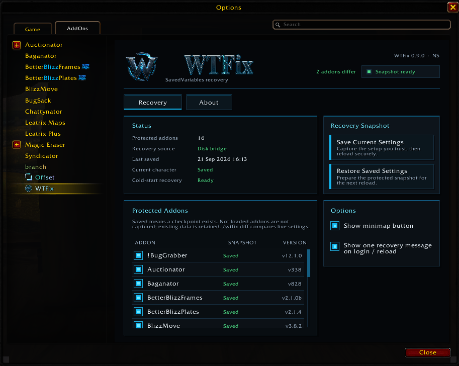
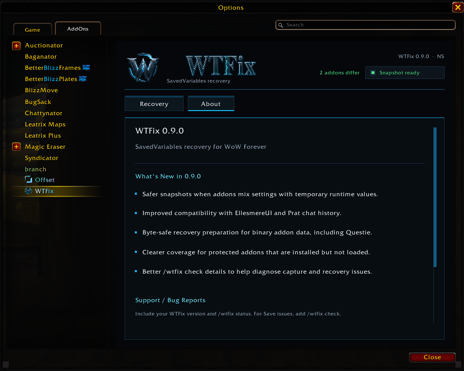

# WTFix

### SavedVariables recovery for **World of Warcraft: Forever (Windows)**

**Save the addon setup you trust. Restore it when something goes wrong. Keep it through reloads and future logins.**

> WTFix creates an explicit trusted checkpoint of your addon SavedVariables and restores that checkpoint until **you** choose to replace it.

---

## Download

### GitHub — recommended for a complete installation

**[Download WTFix 0.9.1](https://github.com/eggntoast/WTFix-Public/releases/tag/v0.9.1)**

| Package | Use |
| --- | --- |
| `WTFix-Full-0.9.1.zip` | **Recommended for a fresh installation.** Includes the addon runtime, launcher and preparation components. |
| `WTFix-Launcher-0.9.1.zip` | For users who already install the WTFix addon/runtime separately, including through CurseForge. |

> Do **not** use GitHub's automatically generated **Source code** ZIP/TAR files as installation packages. Use the named WTFix downloads from the Releases page.

CurseForge distributes the addon/runtime separately. GitHub provides the Full and Launcher packages.

---

## Important: updating from 0.8.8

**Update both the WTFix addon and the launcher.**

Then, with WoW completely closed, run the **current launcher once** so WTFix regenerates preparation using the byte-safe SavedVariables handling introduced in 0.9.0.

Updating only the addon leaves older generated bootstrap data in place.

WTFix 0.9.0 prevents new byte/encoding corruption in binary or non-UTF-8 SavedVariables data. It cannot reconstruct data that was already corrupted by an older preparation. Preserve known-good backups if you suspect an earlier launcher affected your settings.

---

## What WTFix does

WTFix is designed around one simple idea:

**save a known-good addon setup and keep it trusted until you explicitly save another one.**

It supports addons declaring standard:

- account-wide SavedVariables
- per-character SavedVariables
- combinations of both

Coverage depends on what each addon actually stores in its declared SavedVariables.

### Save

**Save Current Settings → Save Snapshot → Reload Now**

The selected addon settings become your trusted recovery checkpoint.

### Restore

**Restore Saved Settings → Prepare Restore → Reload Now**

WTFix restores the trusted checkpoint and discards unsaved changes for protected addons.

---

## Windows preparation is required

Installing the addon runtime alone does **not** prepare recovery.

With WoW closed, run:

`WTFix Launcher.cmd`

The launcher prepares the recovery environment, verifies the disk bridge, backs up recovery inputs and opens Battle.net.

Until preparation succeeds, WTFix clearly shows:

> **SETUP REQUIRED**

and keeps **Save** and **Restore** disabled.

After successful preparation:

- keep both **WTFix** and **WTFix_Data** enabled
- normal `/reload` works
- relogs and full client restarts work
- the launcher does **not** remain running in the background
- you do **not** need to run it before every WoW session

See the full [installation guide](docs/installation.md).

---

## WTFix 0.9.1

What's new:

- More reliable character-specific recovery when Forever's in-game character name and internal character-folder identity differ.
- Ambiguous character-directory matches are not guessed.
- Save validates the complete assembled checkpoint against recovery limits before replacing the previous trusted checkpoint.
- If complete-checkpoint validation fails, the previous trusted checkpoint remains intact.

This is a recovery-hardening release. **Bridge protocol 1 and snapshot schema 1 are unchanged.**

---
## WTFix 0.9.0

What's new:

- Safer snapshots when addons mix persistent settings with temporary runtime-only values.
- Compatibility improvements for **EllesmereUI** and **Prat** chat history.
- Byte-safe recovery preparation for binary and non-UTF-8 SavedVariables data, including **Questie-style binary stores**.
- Installed protected addons that are not currently loaded now show **Not loaded** instead of incorrectly reducing active recovery coverage.
- Improved `/wtfix check` diagnostics.
- New **Recovery** and **About** tabs with current changes and a copyable bug-report link.

See the full [changelog](CHANGELOG.md).

---

## Addons with runtime-only values

Some addons place runtime objects or methods inside tables that also contain persistent settings.

WTFix 0.9.0 captures the persistable scalar/table data while omitting nested runtime-only `function`, `userdata` and `thread` values.

Those omissions are reported rather than silently hidden.

Unsupported roots, unsafe keys, cycles and other structural failures still block Save instead of replacing the trusted checkpoint with incomplete data.

---

## Installed but not loaded addons

An installed protected addon can be disabled, unavailable for the current game type or waiting to load on demand.

WTFix now reports these as:

> **Not loaded**

They do not count as active missing recovery coverage merely because their globals are unavailable while the addon is not running.

Existing checkpoint/fallback data is retained.

---

## Addons with their own Apply / Reload button

Some addons keep changed settings in private working state until their own **Apply** or **Reload** action writes those settings into SavedVariables.

For those addons:

1. Disable WTFix protection for that addon.
2. Make the intended settings changes.
3. Use the addon's own Reload/Apply mechanism.
4. Verify the settings survived the reload.
5. Re-enable WTFix protection.
6. Explicitly **Save Snapshot** in WTFix.

Re-enabling protection alone does **not** adopt the changed settings.

Deleting another addon's SavedVariables is **not** part of the normal WTFix workflow.

See [Save, Restore and pending settings](docs/usage.md).

---

## Commands

| Command | Purpose |
| --- | --- |
| `/wtfix` | Open the WTFix panel |
| `/wtfix status` | Show preparation, checkpoint and recovery status |
| `/wtfix diff` | Show SavedVariable paths that differ from the trusted checkpoint |
| `/wtfix check` | Diagnose current capture compatibility and recovery-input coverage without saving or restoring |

A difference is not automatically a problem. Addons may update counters, caches, history and other session data after login.

`/wtfix check` does **not** Save, Restore, reload, or adopt a new checkpoint.

---

## Reporting a bug

Open:

**`/wtfix → About → Report a Bug`**

or visit:

**https://github.com/eggntoast/WTFix-Public/issues**

Include:

- WTFix version
- affected addon and version
- `/wtfix status`
- for Save/capture problems, `/wtfix check`
- the exact steps that led to the problem

Review logs and SavedVariables before posting them publicly; they may contain personal data.

---

## Recovery model

WTFix deliberately does **not** silently trust later changes.

- Save Snapshot captures declared SavedVariables when you explicitly save.
- Later addon writes do not silently replace the trusted checkpoint.
- Re-enabling protection does not automatically adopt changed data.
- Restore returns protected addons to the saved checkpoint.
- If preparation cannot be trusted, WTFix fails closed instead of pretending recovery is active.

---

## Documentation

- [Installation & setup](docs/installation.md)
- [Save, Restore & pending settings](docs/usage.md)
- [Preparation & ownership](docs/preparation.md)
- [Troubleshooting](docs/troubleshooting.md)
- [Source layout](docs/source-layout.md)
- [Licenses & third-party notices](docs/licenses.md)

---

## License

WTFix is released under the **MIT License**.

Bundled third-party components retain their respective licenses, copyrights and notices.

---

### Built for recovery, not guesswork.

**Save a setup you trust. Keep control over when it changes. Restore it when you need it.**