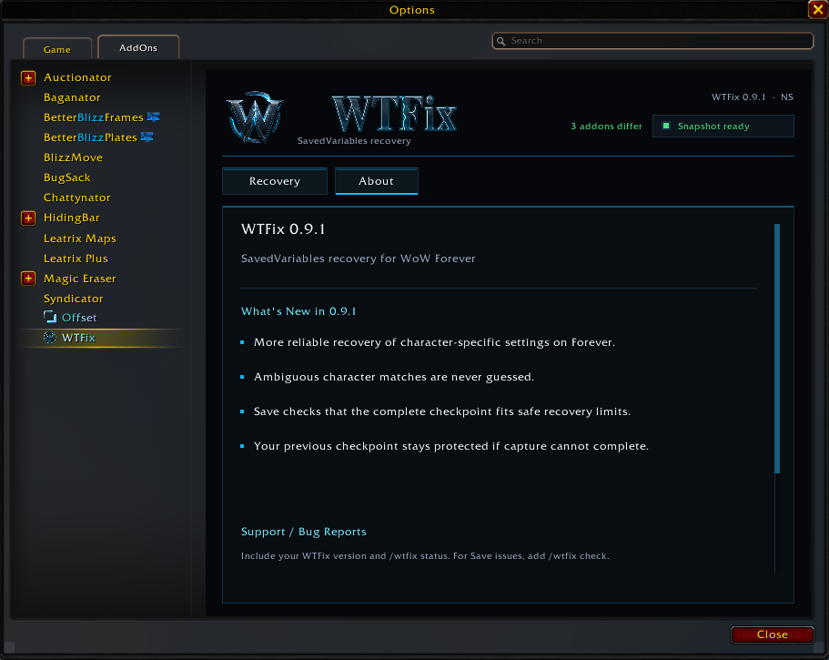

# WTFix

### SavedVariables recovery for **World of Warcraft: Forever (Windows)**

**Save the addon setup you trust. Restore it when something goes wrong. Keep it through reloads and future logins.**

> WTFix creates an explicit trusted checkpoint of your addon SavedVariables and restores that checkpoint until **you** choose to replace it.

---

## Download

### GitHub — recommended for a complete installation

**[Download WTFix 0.9.1](https://github.com/eggntoast/WTFix-Public/releases/tag/v0.9.1)**

| Package | Use |
| --- | --- |
| `WTFix-Full-0.9.1.zip` | **Recommended for a fresh installation.** Includes the addon runtime, launcher and preparation components. |
| `WTFix-Launcher-0.9.1.zip` | For users who already install the WTFix addon/runtime separately, including through CurseForge. |

> Do **not** use GitHub's automatically generated **Source code** ZIP/TAR files as installation packages. Use the named WTFix downloads from the Releases page.

CurseForge distributes the addon/runtime separately. GitHub provides the Full and Launcher packages.

---

## Updating

### From 0.9.0

**Update both the WTFix addon/runtime and launcher so the installed components stay on the same release.**

If your existing preparation is healthy, 0.9.1 does not require preparation to be regenerated solely because of this patch.

Run the launcher again with WoW closed after adding characters, changing the selected installation/account, updating managed addons, or if WTFix shows **SETUP REQUIRED**.

### From 0.8.8

**Update both the WTFix addon/runtime and launcher.**

Then, with WoW completely closed, run the **current launcher once** so WTFix regenerates preparation using the byte-safe SavedVariables handling introduced in 0.9.0.

Updating only the addon leaves older generated bootstrap data in place.

The byte-safe preparation prevents new encoding corruption in binary or non-UTF-8 SavedVariables data. It cannot reconstruct data that was already corrupted by an older preparation. Preserve known-good backups if recovery may be required.

---

## What WTFix does

WTFix is designed around one simple idea:

**save a known-good addon setup and keep it trusted until you explicitly save another one.**

It supports addons declaring standard:

- account-wide SavedVariables
- per-character SavedVariables
- combinations of both

Coverage depends on what each addon actually stores in its declared SavedVariables.

### Save

**Save Current Settings → Save Snapshot → Reload Now**

WTFix captures the currently committed SavedVariables for the protected addons and makes them your new trusted recovery checkpoint.

### Restore

**Restore Saved Settings → Prepare Restore → Reload Now**

WTFix restores the trusted checkpoint and discards unsaved changes for protected addons.

> [!IMPORTANT]
> WTFix protects the SavedVariables state that actually exists when you save the snapshot.
>
> Some addons do not immediately commit every settings change to SavedVariables. If an addon has its own **Apply** or **Reload** workflow, complete that first and verify the settings survived before creating a new WTFix snapshot.

---

## Windows preparation is required

Installing the addon runtime alone does **not** prepare recovery.

With WoW closed, run:

`WTFix Launcher.cmd`

The launcher prepares the recovery environment, verifies the disk bridge, backs up recovery inputs and opens Battle.net.

Until preparation succeeds, WTFix clearly shows:

> **SETUP REQUIRED**

and keeps **Save** and **Restore** disabled.

After successful preparation:

- keep both **WTFix** and **WTFix_Data** enabled
- normal `/reload` works
- relogs and full client restarts work
- the launcher does **not** remain running in the background
- you do **not** need to run it before every WoW session

See the full [installation guide](docs/installation.md).

---

## WTFix 0.9.1

What's new:

- More reliable character-specific recovery when Forever's in-game character name and internal character-folder identity differ.
- Ambiguous character-directory matches are not guessed.
- Save validates the complete assembled checkpoint against recovery limits before replacing the previous trusted checkpoint.
- If complete-checkpoint validation fails, the previous trusted checkpoint remains intact.

This is a recovery-hardening release. **Bridge protocol 1 and snapshot schema 1 are unchanged.**

See the full [changelog](CHANGELOG.md) for previous releases.

---

## Addons with runtime-only values

Some addons place runtime objects or methods inside tables that also contain persistent settings.

WTFix 0.9.0 captures the persistable scalar/table data while omitting nested runtime-only `function`, `userdata` and `thread` values.

Those omissions are reported rather than silently hidden.

Unsupported roots, unsafe keys, cycles and other structural failures still block Save instead of replacing the trusted checkpoint with incomplete data.

---

## Installed but not loaded addons

An installed protected addon can be disabled, unavailable for the current game type or waiting to load on demand.

WTFix reports these as:

> **Not loaded**

They do not count as active missing recovery coverage merely because their globals are unavailable while the addon is not running.

Existing checkpoint/fallback data is retained.

---

## Addons with their own Apply / Reload workflow

Some addons keep changed settings in private or temporary working state until their own **Apply** or **Reload** action commits those changes to SavedVariables.

For those addons:

1. Temporarily disable WTFix protection for that addon.
2. Make the intended settings changes.
3. Use the addon's own **Apply** or **Reload** mechanism.
4. Verify the intended settings survived the reload.
5. Re-enable WTFix protection.
6. Use **Save Current Settings → Save Snapshot → Reload Now**.

Re-enabling protection alone does **not** adopt the changed settings.

> [!IMPORTANT]
> If the addon cannot preserve its own settings after its own Apply/Reload step, do **not** immediately create a new WTFix snapshot.
>
> First establish a known-good addon state, then let WTFix adopt that state.

Deleting another addon's SavedVariables is **not part of the normal WTFix workflow**.

However, WoW Forever currently has some addon-specific SavedVariables problems that may require a separate repair before WTFix can protect the resulting good state.

See [Save, Restore and pending settings](docs/usage.md).

---

## ⚠️ WoW Forever SavedVariables quirks

Some addons can appear to reset or revert even though WTFix itself is restoring exactly the SavedVariables state it was previously told to trust.

The important distinction is:

> **WTFix can only protect the state that the addon has actually committed to SavedVariables.**

Different addons handle that state differently.

### Leatrix Plus

**Leatrix Plus currently has a known settings-saving problem on WoW Forever.**

If Leatrix Plus keeps reverting settings even after using its own Reload button, the following repair has been confirmed to work.

> [!WARNING]
> This is a specific Leatrix Plus / WoW Forever persistence workaround.
>
> It is **not** the normal WTFix setup procedure and should not be assumed to apply to every addon.

1. Log into WoW with both **WTFix** and **Leatrix_Plus** enabled.

2. Keep WoW running and Alt+Tab to your account SavedVariables folder:

   `World of Warcraft\_classic_beta_\WTF\Account\<account>\SavedVariables`

3. Find:

   `Leatrix_Plus.lua`

4. Delete **`Leatrix_Plus.lua` while WoW is still running**.

   If you do not need the backup, you can also delete:

   `Leatrix_Plus.lua.bak`

   **Do NOT use `/reload` yet.**

5. Alt+Tab back into WoW.

6. Configure **Leatrix Plus exactly how you want it**.

7. If Leatrix Plus shows its own **Reload** button, use that button.

8. After the interface reloads, reopen Leatrix Plus and **confirm that the settings are still enabled**.

9. Open WTFix and make sure **Leatrix_Plus is checked in the Protected Addons list**.

10. Use:

   **Save Current Settings → Save Snapshot → Reload Now**

After that reload, the repaired Leatrix Plus state should remain saved and **WTFix should now be protecting that new working state**.

### Why the Leatrix Plus workaround works

The important part is that `Leatrix_Plus.lua` is removed **while Leatrix Plus is already loaded in the running game**.

Deleting the disk file does not erase the already-loaded configuration from memory.

Leatrix Plus can then write a fresh SavedVariables state through its own Reload process.

Once that fresh state survives Leatrix Plus's own reload, WTFix can safely adopt it as the new trusted checkpoint.

You should **not need to repeat this entire repair process for every future Leatrix Plus setting change** once a healthy state has been established and saved.

Leatrix itself currently documents the settings-not-saving behavior as a **WoW Forever game bug**.

See the ongoing compatibility report and detailed discussion in:

**[Issue #4 — Leatrix Plus / Leatrix Maps / similar SavedVariables behavior](https://github.com/eggntoast/WTFix-Public/issues/4)**

---

## Other addons with similar symptoms

Other addons can show similar symptoms on WoW Forever, but they do **not necessarily require the Leatrix Plus file-deletion workaround**.

### Baganator

Baganator has been successfully recovered without deleting its SavedVariables.

The working sequence was:

1. Disable **Baganator** protection in WTFix.
2. Use `/reload`.
3. Configure Baganator or import the desired Baganator configuration.
4. Confirm the settings are correct.
5. Re-enable Baganator protection in WTFix.
6. Use:

   **Save Current Settings → Save Snapshot → Reload Now**

After the new snapshot is created, WTFix protects the newly configured Baganator state.

### Other addons

Addons such as:

- BetterBlizzFrames
- Chattynator
- Farmer
- Leatrix Maps
- other addons with their own persistence or Apply/Reload behavior

may show similar symptoms, but their exact persistence behavior is still being investigated.

Do **not** assume that deleting their SavedVariables is the correct fix.

The general rule is:

> [!IMPORTANT]
> **Make sure the addon itself has successfully committed the settings you want before creating a new WTFix snapshot.**

If the addon cannot preserve its own configuration while temporarily excluded from WTFix recovery, the addon may require its own persistence repair before WTFix can safely adopt the new state.

---

## Commands

| Command | Purpose |
| --- | --- |
| `/wtfix` | Open the WTFix panel |
| `/wtfix status` | Show preparation, checkpoint and recovery status |
| `/wtfix diff` | Show SavedVariable paths that differ from the trusted checkpoint |
| `/wtfix check` | Diagnose current capture compatibility and recovery-input coverage without saving or restoring |

A difference is not automatically a problem. Addons may update counters, caches, history and other session data after login.

`/wtfix check` does **not** Save, Restore, reload, or adopt a new checkpoint.

---

## Reporting a bug

Open:

**`/wtfix → About → Report a Bug`**

or visit:

**https://github.com/eggntoast/WTFix-Public/issues**

Include:

- WTFix version
- affected addon and version
- `/wtfix status`
- for Save/capture problems, `/wtfix check`
- the exact steps that led to the problem
- whether the addon keeps the intended settings while temporarily excluded from WTFix protection
- whether the addon has its own Apply/Reload mechanism

Review logs and SavedVariables before posting them publicly; they may contain personal data.

---

## Recovery model

WTFix deliberately does **not** silently trust later changes.

- Save Snapshot captures the protected addon's currently committed SavedVariables when you explicitly save.
- Later addon writes do not silently replace the trusted checkpoint.
- Re-enabling protection does not automatically adopt changed data.
- Restore returns protected addons to the saved checkpoint.
- If preparation cannot be trusted, WTFix fails closed instead of pretending recovery is active.
- WTFix does not automatically guess that a newly changed or larger addon state should replace the checkpoint you explicitly trusted.

This explicit adoption boundary is intentional.

---

## Documentation

- [Installation & setup](docs/installation.md)
- [Save, Restore & pending settings](docs/usage.md)
- [Preparation & ownership](docs/preparation.md)
- [Troubleshooting](docs/troubleshooting.md)
- [Source layout](docs/source-layout.md)
- [Licenses & third-party notices](docs/licenses.md)

---

## License

WTFix is released under the **MIT License**.

Bundled third-party components retain their respective licenses, copyrights and notices.

---

### Built for recovery, not guesswork.

**Save a setup you trust. Keep control over when it changes. Restore it when you need it.**
